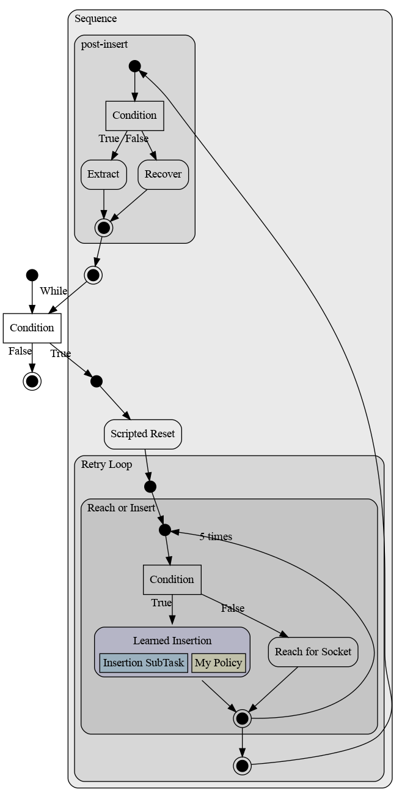

# Control-Flow Ops Examples w/ rendering.

## Examples

The control_flow directory contains several examples for how to build and
visualize AgentFlow graphs that use control flow options.


### simple_insertion.py

This example uses `Cond`, `Repeat`, and `Sequence` to construct a graph for a
plug-insertion experiment which combines a single learner with a set of scripted
behaviors.



The code to create these options is:

```python
# Use some AgentFlow operators to embed the agent in a bigger agent.
# First use Cond to op run learned-agent if sufficiently close.
reach_or_insert_op = af.Cond(
    cond=near_socket,
    true_branch=learned_insert_option,
    false_branch=reach_option,
    name='Reach or Insert')

# Loop the insert-or-reach option 5 times.
reach_and_insert_5x = af.Repeat(
    5, reach_or_insert_op, name='Retry Loop')

loop_body = af.Sequence([
    scripted_reset,
    reach_and_insert_5x,
    af.Cond(
        cond=last_option_successful,
        true_branch=extract_option,
        false_branch=recovery_option,
        name='post-insert')
])
main_loop = af.While(lambda _: True, loop_body)
```
