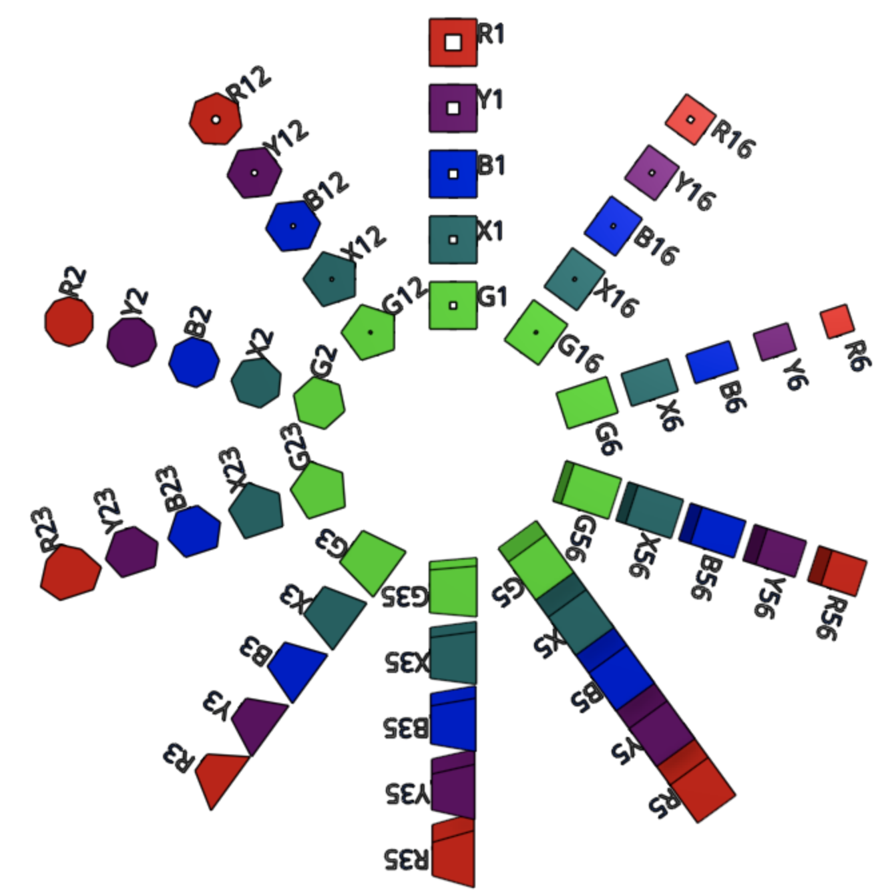

# Parametric RGB-object class documentation &#128721;&#129001;&#128311;

The `RgbObject` class helps manipulating the RGB-objects. The RGB-objects are
obtained in [OnShape][OnShapeAPI] by extruding a 2D-shape. Both the extrusion
and the 2D shapes are described parametrically. The shape of an RGB-object is
described by few parameters bounded by min-max values. Boundaries can be
expressed also with respect to other parameters.  Nine parameters
are currently used:

1.  **`sds`: integer-valued[]**. The number of edges used to generate the
    regular 2D shape.

2.  **`shr`: real-valued [%]**. The percentage of 'shrinking' applied to the 2D
    shape. In the 2D plane, the shape is y-shrunk along the x-axis according to
    the formula: $$ y_{new} = (1 - \mbox{shr} \cdot x)*y_{old} $$.

3.  **`drf`: real-valued [deg]**. The amount of
    [draft](https://en.wikipedia.org/wiki/Draft_\(engineering\)) used in the
    extrusion.

4.  **`hlw`: real-valued [%]**. The percentage of material to be removed from
    each of the generated faces of the solid (to make it hollow).

5.  **`shx`: real-valued [deg]**. The solid angle of the extrusion axis along
    the x-axis.

6.  **`shy`: real-valued [deg]**. The solid angle of the extrusion axis along
    the y-axis.

7.  **`scx`: real-valued [mm]**. The global x-scale.

8.  **`scy`: real-valued [mm]**. The global y-scale.

9.  **`scz`: real-valued [mm]**. The global z-scale.

The values of these parameters are constrained in such a way that **each valid
RGB-shape has a one-to-one mapping with the associated parameters**. The
`ParametricProperties` is used to check and keep track of valid values for the
parameters.

RGB-shapes, part 1                          | RGB-shapes, part 2
:-----------------------------------------: | :--------------------:
     | 

--------------------------------------------------------------------------------

You can get more details about the RGB-objects &#128721;&#129001;&#128311; at
[go/rgb-stacking][go/rgb-stacking].

<!-- Hyperlinks  -->

[OnShapeAPI]: https://onshape-public.github.io/docs/

[go/rgb-stacking]:
https://sites.google.com/corp/google.com/rgb--stacking#h.p_Hbvm_ijsde_K
