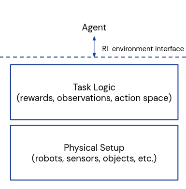
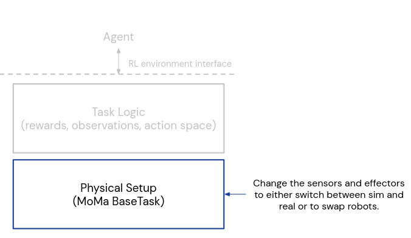
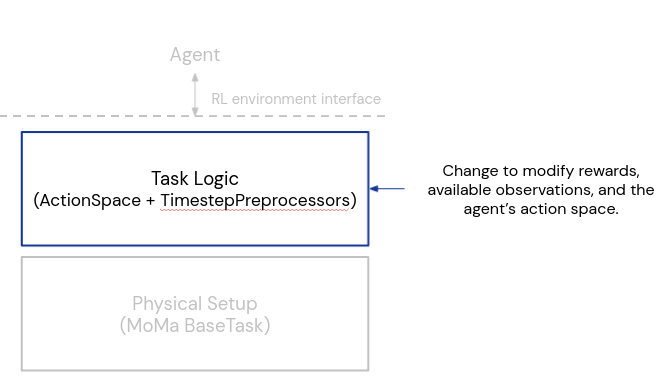

# Modular Manipulation (MoMa)

DeepMind's library for building modular robotic manipulation environments, both
in simulation and on real robots.

## Quick Start

An quick-start introductory tutorial can be found at this Colab:

## Overview

MoMa builds on DeepMind's [Composer library] \(part of [`dm_control`]\).
Composer helps build simulation environments for reinforcement-learning,
providing tools to define actions, observations, and rewards based on MuJoCo
entities.

MoMa wraps Composer to make it easy to build manipulation environments, and the
abstractions MoMa introduces allow these environments to work in both
simulation and the real world.

## Important Abstractions

MoMa is designed to be modular with respect to the robots in an environment,
whether running in simulation or reality, and the task-specific game logic for
a single RL environment.

MoMa does this by separating an RL environment into 2 components, the physical
setup and the task logic.

### Hardware Abstraction

MoMa enforces that the only way to interact with an RL environment is via a
set of sensors and effectors, which define the input-output interface of the
environment.

[Sensors] provide an abstraction for real hardware sensors, but they can be
used in simulation as well. They read in information from the simulated or
real world and produce the observations in an RL environment. The [`sensors`]
package provides several ready-to-use sensors. You will see examples of sensors
that are used to collect robot joint positions, object positions, gripper
state, etc.

[Effectors] consume the actions in an RL environment and actuate robots, again
either in simulation or the real world. The [`effectors`] package provides
several commonly-used effectors.

At MoMa's core is [`BaseTask`], a variant of `composer.Task` which contains a
set of sensors and effectors. With this abstraction, `BaseTask` can encapsulate
a manipuation environment for any robot arm(s) and gripper(s), in either
simulation or in reality.

### Task Logic

`BaseTask` represents a "physical" environment (e.g. a single Sawyer
arm and Robotiq gripper with 2 cameras, running either in simulation or
reality), but that alone doesn't define a _complete_ RL environment. For an RL
environment, we need to define the agent's actions, the observations, and the
rewards.

We use 2 abstractions from DeepMind's [AgentFlow] to help define things.

1. [`agentflow.ActionSpace`] maps the agent's actions to a new space or to
   relevant effectors in the `BaseTask`.

2. [`agentflow.TimestepPreprocessor`] modifies the base RL timestep before
   returning it to the agent. They can be used to modify observations, add
   rewards, etc. They can also be chained together. The name "timestep
   preprocessor" comes from the fact that the timestep is preprocessed before
   being passed on to the agent. The [`agentflow.preprocessors`] package
   contains many useful, ready-to-use timestep preprocessors.

Together, the `ActionSpace` and `TimestepPreprocessor` define the "game logic"
for an RL environment, and they are housed inside an [`agentflow.SubTask`].

If you have a fixed physical setup and you just want to change the task, all
you need to change is the `af.SubTask`. Likewise, if you have a single task but
want to switch the hardware or switch between sim and real, you can fix the
`af.SubTask` and just change the `BaseTask`. See the AgentFlow documentation
for more information.

## Putting It All Together

### Single Task

In cases where there is only one objective for the RL agent (i.e. one instance
of the game-logic), you can use MoMa's [SubtaskEnvironment], which exposes a
single `agentflow.SubTask` with Deepmind's standard RL environment interface,
[dm_env.Environment].

Here is a diagram presenting the different components of a MoMa subtask
environment along with an explanation of information flow and different links to
the code.

1.  The agent sends an action to a MoMa `SubTaskEnvironment` which serves as a
    container for the different components used in a task. The action is passed
    to an AgentFlow `ActionSpace` that projects the agent's action to a new
    action space that matches the spec of the underlying effector(s).

2.  The projected action is given to effectors. This allows us to use both sim
    or real robots for the same task.

3.  The effectors then actuate the robots either in sim or in real.

4.  The sensors then collect information from the robotics environment. Sensors
    are an abstraction layer for both sim and real, similar to Effectors.

5.  The `BaseTask` then passes the timestep to an AgentFlow
    `TimestepPreprocessor`. The preprocessor can change the timestep's
    observations and rewards, and it can terminate an RL episode if some
    termination criteria are met.

6.  The modified timestep is then passed on to the agent.

### Multiple Tasks

Given a single `BaseTask` which represents a collection of robots and sensors,
we can support multiple RL tasks and "flow" between them. Each RL task is an
[`agentflow.SubTask`], containing its own "game logic" specifying the agent's
action space, observations, rewards, and episode termination criteria.

AgentFlow contains utilities to specify these different subtasks and define
how the agent can move from subtask to subtask. Please see the AgentFlow docs
for more information.

## Creating a task with MoMa

### Creating a task in a new environment

To build a new MoMa environment, you can use the [subtask_env_builder]
pattern. An example of this pattern can be found in our [example task] and in
the tutorial linked at the top.

[Composer library]: https://deepmind.com/research/publications/dm-control-Software-and-Tasks-for-Continuous-Control
[`dm_control`]: https://github.com/deepmind/dm_control/tree/master
[Sensors]: https://github.com/deepmind/dm_robotics/tree/main/py/moma/sensor.py
[`sensors`]: https://github.com/deepmind/dm_robotics/tree/main/py/moma/sensors/
[Effectors]: https://github.com/deepmind/dm_robotics/tree/main/py/moma/effector.py
[`effectors`]: https://github.com/deepmind/dm_robotics/tree/main/py/moma/effectors/
[`BaseTask`]: https://github.com/deepmind/dm_robotics/tree/main/py/moma/base_task.py
[SubtaskEnvironment]: https://github.com/deepmind/dm_robotics/tree/main/py/moma/subtask_env.py
[dm_env.Environment]: https://github.com/deepmind/dm_env/tree/master
[AgentFlow]: https://github.com/deepmind/dm_robotics/tree/main/py/agentflow/README.md
[`agentflow.ActionSpace`]: https://github.com/deepmind/dm_robotics/tree/main/py/agentflow/action_spaces.py
[`agentflow.TimestepPreprocessor`]: https://github.com/deepmind/dm_robotics/tree/main/py/agentflow/preprocessors/timestep_preprocessor.py
[`agentflow.SubTask`]: https://github.com/deepmind/dm_robotics/tree/main/py/agentflow/subtask.py
[`agentflow.SubTask`]: https://github.com/deepmind/dm_robotics/tree/main/py/agentflow/subtask.py
[`agentflow.preprocessors`]: https://github.com/deepmind/dm_robotics/tree/main/py/agentflow/preprocessors/
[subtask_env_builder]: https://github.com/deepmind/dm_robotics/tree/main/py/moma/subtask_env_builder.py
[example task]: https://github.com/deepmind/dm_robotics/tree/main/py/moma/tasks/example_task/example_task.py
